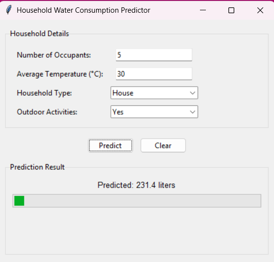

# 💧 Water Consumption Predictor

<p align="center">
  
</p>

A machine learning system that predicts household water consumption with **85% accuracy**. Combines a Flask API backend with an intuitive Tkinter GUI.

## 🚀 Features

### Predictive Analytics
- 📊 Forecasts daily water usage (in liters)
- 🌡️ Accounts for weather and household characteristics
- 🔄 Automatic retraining when new data is added

### Technical Stack
| Component          | Technology |
|--------------------|------------|
| Machine Learning   | scikit-learn |
| Backend API        | Flask      |
| Frontend           | Tkinter    |

## 📂 Project Structure
```
water-consumption-predictor/
├── backend/
│   ├── app.py              # Flask API
│   ├── models/             # ML artifacts
│   └── data_water_consumption.xlsx
├── frontend/
│   └── frontend.py          # Tkinter GUI
└── requirements.txt
```

## 🛠️ Installation
```bash
git clone https://github.com/lana-mustafic/water-consumption-predictor.git
cd water-consumption-predictor
pip install -r requirements.txt
```

## 🏃‍♂️ Quick Start
1. **Launch Backend**:
```bash
cd backend
python app.py
```

2. **Run GUI**:
```bash
cd ../frontend
python frontend.py
```

## 🤝 How to Contribute
1. Fork the repository
2. Create feature branches
3. Submit PRs with tests

## 📜 License
MIT © 2023 Lana Mustafić
